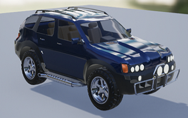
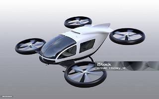
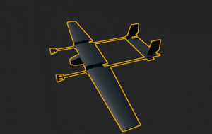
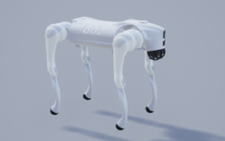
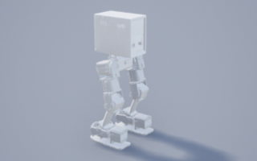

## WingSim

**本项目的出发点：强化学习核心的内容是仿真环境，仿真环境2个核心包括：机器人自身的物理仿真，环境仿真，UE4自身是游戏引擎，有着众多地图资产，因此环境仿真有充足的资源可以直接使用，不需要重新构建，WingSim基于UE4，物理仿真采用的是开源的引擎Physx，做机器人的物理仿真基本够用（Nvidia Isaac sim 用的也是Physx），因此我们有了用基于UE4做机器人强化学习仿真的想法，也就是我们的WingSim平台**

随着人形机器人、EVTOL、四旋翼和自动驾驶等无人系统的快速发展，开发者对于无人系统仿真测试环境的需求也日渐显现。尤其是近些年来深度学习、强化学习等人工智能技术也逐渐在无人系统进行落地研究和使用，更是增加了对仿真测试环境的强烈需求。我们根据当前无人仿真测试环境的开发需求开发了一款WingSim智能仿真平台。提供无人系统从算法开发、到软件在环仿真、再到真机部署实验的全流程自动化解决方案。

WingSim仿真平台基于开源项目[AirSim](https://github.com/microsoft/AirSim)进行二次开发，在[AirSim](https://github.com/microsoft/AirSim)的基础上增加了URDF机器人、EVTOL和固定翼三类载具仿真，当前项目的核心是URDF机器人功能。

| **Vehicle** | **image** | **doc** | **note** |
|---|---|---|---|
| MultiRotor |  |  | Inherit |
| Car |  |  | Inherit |
| Evtol |  |  | not yet |
| FixedWing |  |  | New |
| Robot |   |  | New |

### WingSim设计理念

WingSim智能仿真平台基于开源项目AiSim进行二次开发，AirSim 是微软开源的一个跨平台的建立在仿真引擎（UE4、Unity）上的无人机以及其它无人车的模拟器。 它支持SITL和HITL的仿真模拟。AirSim可以被开发为一个UE4的插件，可以简单地放到任何虚幻环境中。
借助于UE4，AirSim创造了一个高还原的逼真虚拟环境，模拟了光照、阴影、反射等其它现实世界中容易干扰的环境，让无人机在仿真环境中尽量学习到和现实世界接近的场景。AirSim 的目标是作为 AI 研究的平台，以测试深度学习、计算机视觉和自主车辆的强化学习算法。

>为什么我们要基于AirSim？

由于AirSim优秀的设计理念，它采用模块化设计，强调可扩展性。核心组件包括环境模型、载具模型、物理引擎、传感器模型、渲染接口、公共API层和载具接口，通信固件几部分。如下图所示，AirSim采用C++对每一个部分都进行了功能抽象，所以在每个功能都可以依赖于抽象出来的公共功能再次迭代增加额外的功能。

但是当前AirSim的功能和使用场景仍比较初级，尤其是在载具支持方面，AiSim只提供四旋翼、无人车两种载具模型，AirSim的功能都是依赖于这两种载具进行Demo演示，远远达不到我们实际需求的目标。可以这样说，AirSim对仿真框架做了很好的抽象和架构设计，但在功能完善上仍然存在很多不足。例如，我们在飞行器仿真的时候除了四旋翼需要还有很多飞行器的仿真，例如：固定翼、EVTOL、无人船、无人艇等，这些不同的载具的模型设计和控制模型和四旋翼都存在巨大差异，AirSim开源社区并没有对这些功能进行开发，四旋翼作为一个样例的载具，实现了一些设计的基本功能。因此，WingSim智能仿真平台依赖于AirSim的基础功能进一步对URDF机器人、固定翼、EVTOL等载具做一个拓展，以支持更多的载具。

AirSim最新的版本停留在2022年的V1.18.1版本，因此WingSim的V1.00版本基于AirSim V1.18.1进行开发。WingSim的软件来源于开源社区也会回馈开源社区，在WingSim的开发过程中，涉及和仿真架构相关的通用功能将会发布源代码至WingSim的开源项目。而根据特殊项目开发的软件功能，由于通用性较差，避免污染开源社区通用的软件架构，这部分功能将不进行开源，根据实际情况发布二进制文件。

### WingSim软件架构
WingSim针对不同载具的仿真进行仿真配置，WingSim基于AirSim，所以AirSim支持的四旋翼和无人车WingSim也是天然支持的，WingSim采用C++编程语言，因此WingSim会直接支持一些内置载具用于仿真实验，例如四旋翼模型的SimpleFlight，固定翼和URDF机器人模型。这意味着在WingSim平台，我们不需要额外配置这几种模型的控制软件（PID飞行控制）和对应的物理模型即可在WingSim平台中直接使用。

内置载具的软件框架主要包含2部分，外部资源和WingSim仿真，在这个软件架构中，由于载具的控制、动力学模型、运动学模型都内嵌在WingSim里面，所以只需要外部资源的控制输入，控制输入可以来自于手柄，也可以来自于任务计算机的控制指令，如果是有人控制，那么使用手柄让无人机在仿真环境中飞行，如果是无人控制，开发者可以在Companion Computer上设置自动飞行的程序通过API Layer给无人机的飞控传输指令。同时我们也可以通过API Layer获取任何你想要的数据，例如再聚的状态、载具的参数、传感器数据、物理碰撞信息等。上图中红色的线形成了一个环，就是控制领域的闭环控制链路。

由于WingSim的内置载具是纯软件，和硬件平台无关，因此针对WingSim内置载具只能实现SITL仿真测试。
大部分的载具模型由于各种原因很难直接作为WingSim平台的内置功能进行仿真。主要包含如下几种情况：
* 编程语言不兼容，例如某些载具的控制程序不支持C++工程、可能是用Simulink、Python等其他语言编写，这导致载具不能作为WingSim工程的一部分直接编译运行。
* 源代码保护，还有很多载具的控制程序不会开源，但是他们仍然想要利用WingSim仿真平台进行仿真测试、数据采集，这种情况也不能将载具模型内置WingSim。
* 载具模型工程复杂，交联太多，这种情况下也不能合并至WingSim内置功能，例如PX4、Ardupilot等载具和自身的平台有太多的交联，已经形成了庞大的系统，这种也不允许合并WingSim。

能够合并至WingSim内置载具的基本原则就是：简单、C++、开源。上述不符合基本原则的载具可以作为外部载具功能和WingSim进行交互，我们在WingSim留有通信接口，来适配不同的载具。WingSim支持的外部载具功能架构如下图所示，由于这些某些载具不满足上述简单、C++编写和开源三点准则，这些载具的仿真只能通过额外建立通信实现，这样WingSim仿真和载具模型可以分布式部署，实现了解耦。这就是WingSim继承了AirSim的模块化的理念，各个模块可插拔。这一点非常厉害，很多软件越做越复杂，就是因为在底层架构设计上没有考虑清楚，导致根据需求无脑增加功能，最后功能都糅杂在一起，导致软件越来越难用。

## Vehicle仿真

- [MultiRotor](./doc/multirotor.md)
- [Car](./doc/car.md)
- [Evtor(not yet)](./doc/evtol.md)
- [fixedwing](./doc/fixedwing.md)
- [URDF Robot](./doc/urdf_robot.md)

## Sensor仿真

### Camera

### IMU

### Lidar

## todo list

- 迁移至UE5
- Robot的物理约束自动化
- FixedWing修改Bug

## Contribute

## 参考文献及开源代码

